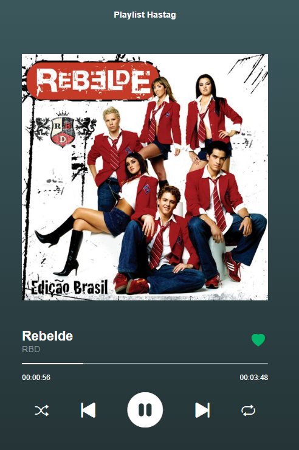

# Aplicação Web  

## **Tocar de Música (Spotify)**

*Página web simulando o aplicativo Spotify. A página possiu botão de play/pause, avançar/retornar, embaralhar lista de músicas, opção de repetição e botão de like*

## Ferramentas

    

    
    
    
    

## Página Principal
  

 

 
 

# Créditos
<table>
  <tr>
    <td align="center">
      <a href="https://github.com/fabriciovale20">
         
        
          <b>Fabrício Vale</b>
        
      </a>
    </td>
  </tr>
</table>